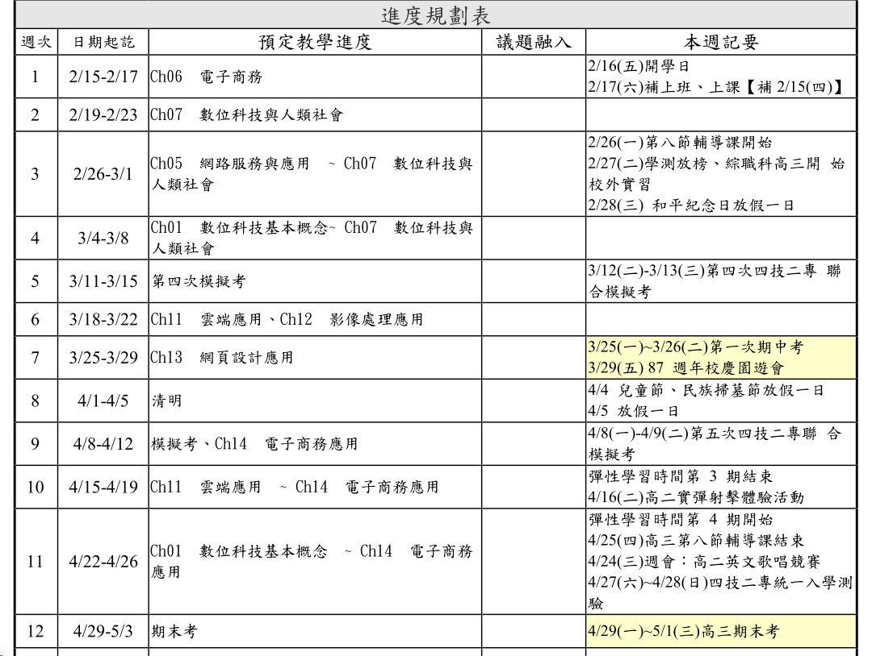

# 上課日誌(下學期)

!!! 重要時程

        - 第 4 次模擬考 (0312 - 0313)
        - 第一次期中考 (0325 - 0326)
        - 第 5 次模擬考 (0408 - 0409)
        - 統一入學測驗 (0427 - 0428)
        - 高三期末考 (0429 - 0501)

## 第 04 週 03-07

- 考 ch1 ~ ch7
- 考第４次模擬考範圍 (ch1 ~ ch10)
- 收錄 ch5、ch2

## 第 03 週 02-29

- 考 ch5 ~ ch7
- 收錄 ch6、ch7

## 第 02 週 02-22

- 考 ch7

## 第 01 週 02-17

- 星期六補課
- 考 ch6

