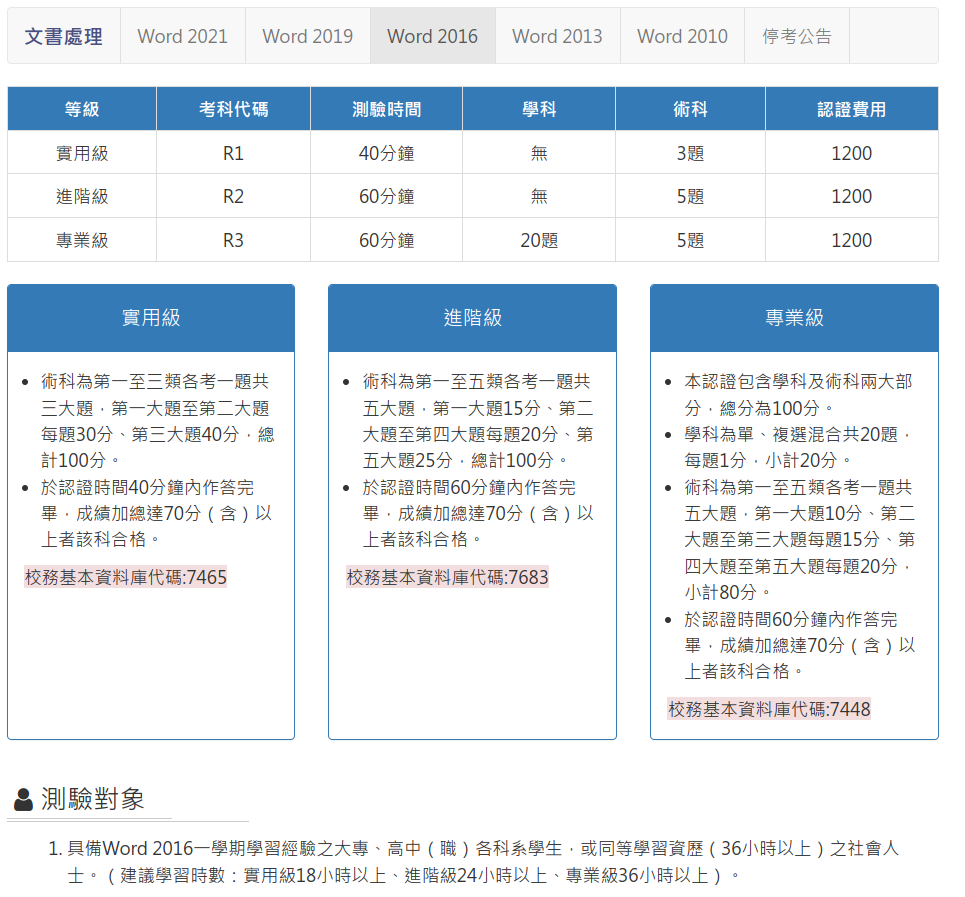

# TQC

[TQC 文書處理](https://www.tqc.org.tw/TQCNet/CertificateDetail.aspx?CODE=CmR0VEl4nBQ=)

## 資源

- 你需要安裝 Word 2016
- [TQC練習系統](https://drive.google.com/file/d/1jnsOhASLYKYHysMg0k8vBRNAcRLmiXa8/view?usp=drive_link)
- [TQC 文書處理 Word 2016 快速解題](https://www.youtube.com/playlist?list=PLedyeCBoM9vuPBGePltjnaBXBTPRLpPLs)