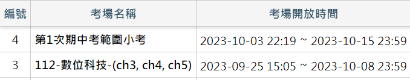

# 上課日誌

資處二甲，112 學年度第 1 學期上課紀錄

!!! info "重要提醒"

    - [平時測驗](https://qe.fisp.com.tw/ep/login_stu.php)
    - [作業](https://classroom.google.com/u/1/w/NjE2NjkwNzczMDMw/tc/NTI5MTYxNDQ4NzU1)
    - 國際運算思維挑戰賽
        - 練習時間：11月6日至11月10日止（已報名學生可登入練習）
        - 挑戰期間：11月13日至11月24日止（教師可於報名時，選擇挑戰期間內的一節課實施）

!!! danger "作業時程"

    - 去背 (10/22)
    - 樣式(小論文) (10/22)
    - 應用第9章 (10/22)
    - 應用第10章：10-3-公式 (1/29)
    - 應用第10章：ex10-03b (10/29)
    - 錄音、照片20、影片 (10/23)

##  第 9 週 (1022-1028)
- 一：
    - 威力導演：幻燈片秀(照片+錄音)
    - 說明運算思維
    - 作業

## 第 8 週 (1015-1021)

- 一：
    - [錄音](./misc/record.md)
    - ch2 影音處理簡介、<del>ch3 軟體基本操作</del>
- 三：
    - [應用 10，需上傳 10-3-公式.xlsx](https://classroom.google.com/c/NjE2NjkwNzczMDMw/a/NjMwMjMwNDQ5MjQ3/details) (c if, d, e, f, <del>g</del>)
    - [應用 10，需上傳 ex10-03b.xlsx](https://classroom.google.com/c/NjE2NjkwNzczMDMw/a/NjMwMjMzMzQ2Mjg1/details) (講一半)
- 五：業師
    - 修圖
    - 濾鏡 - 液化 (體態修飾)
    - 污點修復筆刷
    - 筆刷 (頭髮)
    - 高斯模糊

## 第 7 週 (1008-1014)

- 一：國慶連假
- 三：
    - [應用 10，需上傳 10-3-公式.xlsx](https://classroom.google.com/c/NjE2NjkwNzczMDMw/a/NjMwMjMwNDQ5MjQ3/details) (99乘法, a, b, c if)
- 五：期中考

## 第 6 週 (1001-1007)

- 一
    - 去背，作業 1 (練習)
    - [錄音](./misc/record.md)
- 三：
    - 應用 4、5 章(答案，下星期對習作)
    - 應用 9，需上傳 ans09-03b.xlsx
    - 提醒：有 2 個平時測驗 
- 五：業師 (快速遮色片)

## 第 5 週 (0924-0930)

- 一
    - [題組五](../cert/cert2/resolve-5.md)：前置步驟、附件一
    - 去背，作業 1 (練習)
- 三：[樣式(小論文格式)](misc/template_essay.md)
- 五：中秋節

## 第 4 週 (0917-0923)

- 一
    - [乙級](../cert/cert2/index.md)
    - [題組五](../cert/cert2/resolve-5.md)：5 個 word 檔、Access 查匯入資料
- 三
    - [題組五](../cert/cert2/resolve-5.md)：Access、Access -> Excel、附件一
- 五：業師 (photoshop 去背)
- 六：補 10/9(一)課程。[題組五](../cert/cert2/resolve-5.md)：前置步驟、附件一

## 第 3 週

- 一
    - [第 1 章多媒體簡介](misc/C371A3_1.md)
    - 線上測驗 「多媒體第 1 章」(9/24 截止)
- 三
    - 工場宣導
    - 安全衛生測驗
    - 發測驗卷
    - 第 3 章
- 五：業師 (photoshop 去背)

## 第 2 週

- 一：颱風假
- 三
    - 課諮
    - 應用第 1 章、第 2 章
- 線上測驗 「應用第 1 章、第 2 章」(9/17 截止)
- 五：分流 [極簡計算機](../programming/app_inventor/calculator.md)

## 第 1 週

- 三：開學典禮
- 五：分流 app inventor [環境設定](../programming/app_inventor/env.md)
