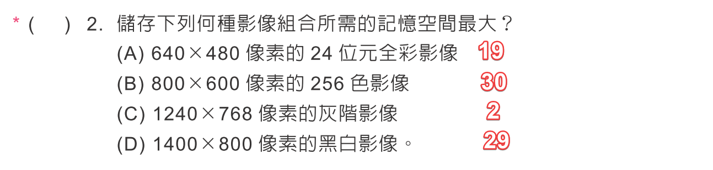

# 第 1 章多媒體簡介

## 多媒體概念

字體、字型：

- [But 專欄｜常常搞混的一些詞](https://blog.justfont.com/2013/02/some_nouns/)
- [字體排版設計 | 字體與字型傻傻分不清楚? 讓你一次就看懂！](https://www.shutterstock.com/zh-Hant/blog/what-is-typeface)

聲音：

- [Audio](https://web.ntnu.edu.tw/~algo/Audio.html)
- [【上篇】音質是如何決定的？](https://perskinn.com.tw/01-sound-quality/)
- [一次搞懂「泛音列」！](https://youtu.be/0iJmDhNocaQ?si=BjKWihLERmpuTiZD)

影像：

-[手機App後製景深效果！輕鬆模糊照片背景、背景虛化【2023 最新】]()

檔案大小：

- 文字
    - ASCII
    - Unicode
- 聲音：
- 圖片：[圖檔大小計算](http://140.121.160.124/fd/size.htm#size)
- 影片

## 多媒體的應用

- [AR VR MR XR的概念](https://www.arplanet.com.tw/about_ar1/)
- [AR、VR、MR、XR 傻傻分不清？快速搞懂看這篇就夠！](https://adersaytech.com/tutorial/tech-event/ar-vr-mr-xr-introduction.html)
- [Apple Vision Pro — Apple 第一部空間運算設備](https://www.apple.com/tw/newsroom/2023/06/introducing-apple-vision-pro/)
- [Microsoft HoloLens 2](https://www.microsoft.com/zh-tw/hololens)

## 多媒體格式

- [音訊檔案格式 - 維基百科](https://zh.wikipedia.org/wiki/%E9%9F%B3%E9%A2%91%E6%96%87%E4%BB%B6%E6%A0%BC%E5%BC%8F)
- [圖形檔案格式比較 - 維基百科](https://zh.wikipedia.org/wiki/%E5%9B%BE%E5%BD%A2%E6%96%87%E4%BB%B6%E6%A0%BC%E5%BC%8F%E6%AF%94%E8%BE%83)
- [視訊檔格式 - 維基百科](https://zh.wikipedia.org/wiki/%E8%A7%86%E9%A2%91%E6%96%87%E4%BB%B6%E6%A0%BC%E5%BC%8F)

- [影片格式選擇障礙? 先來了解一下各種常見的影片編碼格式](https://jacksonlin.net/20221230-how-to-choose-format/)
- [什麼是視訊編碼格式？](https://www.cloudflare.com/zh-tw/learning/video/video-encoding-formats/)

## 智慧財產權簡介

- [著作權、專利權、商標權解析！搞懂 3 大智慧財產權，再喊「抄襲」吧](https://www.managertoday.com.tw/articles/view/59798)
- [學名藥？原廠藥？差別到底在哪裡？](https://heho.com.tw/archives/43493)
- [假貨out！販賣仿冒商品相關法律問題有哪些？](https://www.legis-pedia.com/article/Intellectual-property-rights/830)

## 雜七雜八

