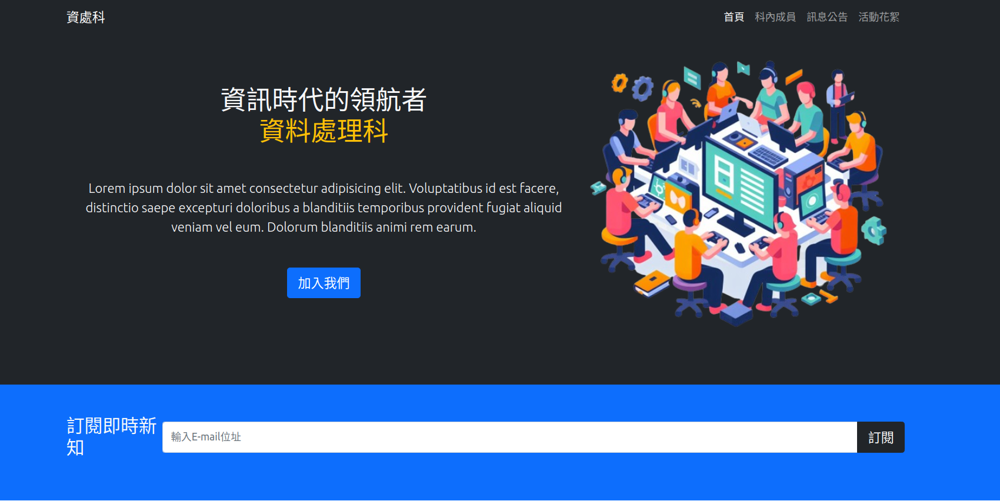
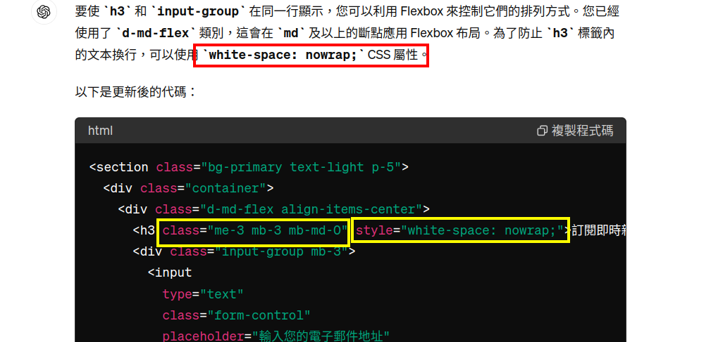

# Bootstrap 5 堆積木

使用 Bootstrap 就像堆積木，就是一直兜上就對了！

## 開始再加個導覽列

1. 加入 css, js [簡介 (Introduction) · Bootstrap 5 繁體中文文件 - 六角學院 v5.1](https://bootstrap5.hexschool.com/docs/5.1/getting-started/introduction/#css)
2. 測試有沒有加對
3. 導覽列 (Navbar) [導覽列 (Navbar) · Bootstrap 5 繁體中文文件 - 六角學院 v5.1](https://bootstrap5.hexschool.com/docs/5.1/components/navbar/)
4. 改背景成暗色 `navbar-dark bg-dark` [背景 (Background) · Bootstrap 5 繁體中文文件 - 六角學院 v5.1](https://bootstrap5.hexschool.com/docs/5.1/utilities/background/)
5. 改 `container` [容器 (Containers) · Bootstrap 5 繁體中文文件 - 六角學院 v5.1](https://bootstrap5.hexschool.com/docs/5.1/layout/containers/)
6. 改選單，不要的元件刪除
8. 靠右對齊 `me-auto` 改成 `ms-auto` [間隔 (Spacing) · Bootstrap 5 繁體中文文件 - 六角學院 v5.1](https://bootstrap5.hexschool.com/docs/5.1/utilities/spacing/)

## CIS 形象廣告

1. 你知道 `div` 是啥嗎？ [\<div\>：內容分區元素 - HTML：超文本標記語言 | MDN](https://developer.mozilla.org/zh-TW/docs/Web/HTML/Element/div)
2. 你知道 `section` 是啥嗎？ [\<section\>：通用區段元素 - HTML：超文本標記語言 | MDN](https://developer.mozilla.org/zh-TW/docs/Web/HTML/Element/section)
3. 目標：左邊有一些字，右邊有一張圖
4. 去用 Edge，"image creator"，產生一張圖，我的咒語是： `產生圖片  svg格式 背景透明 flat 資料處理 電腦 人`，`多幾個人，顯示團隊合作`，`不要穿黑色的，我要把這張圖放在黑色圖片上`
5. 圖太大了，我想要 640x640 大小，用 [Photopea | Online Photo Editor](https://www.photopea.com/) 改一下， [得到這張圖](https://hackmd.io/_uploads/ByIViY4Q0.svg)
6. 圖片竟然沒透明，會不會處理一下啊？
7. 開始了哦：放個 section，改個背景、文字顏色等 `bg-primary text-light p-5 text-center`
8. 放一個 `container`
8. 放個 `div`，設為 flex，`d-flex` [Flex · Bootstrap 5 繁體中文文件 - 六角學院 v5.1](https://bootstrap5.hexschool.com/docs/5.1/utilities/flex/)
9. 裡面放 2 個東西，一個 `div`，一個 `img`
10. 第一個裡面放 `h1`、`p`、`button`。其中標題和段落的細項自己調整
11. `button` 設為 `btn btn-lg btn-primary` [按鈕 (Buttons) · Bootstrap 5 繁體中文文件 - 六角學院 v5.1](https://bootstrap5.hexschool.com/docs/5.1/components/buttons/)
12. `img` 就放入剛剛產生的圖，設為 `img-fluid` [圖片 (Images) · Bootstrap 5 繁體中文文件 - 六角學院 v5.1](https://bootstrap5.hexschool.com/docs/5.1/content/images/)
13. 最後來設一項響應式的部份： img 加入 `d-none d-md-block w-50` 在手機時不要顯示圖片，平板以上顯示圖片，顯示時寬 50%。

## 訂閱新知

1. 來個 `section`，`bg-primary text-light p-5`；再包個 `container`
2. 底部常常貼著最下面，看起來有點彆扭，先在最後面加個高1500px的區塊 `<div style="height:1500px"></div>`   這裡用了一個 *inline style* *行內樣式*
3. 這時，最上面的選單在上下滑動網頁時會不見，將它固定 `fixed-top`  [Position (位置) · Bootstrap 5 繁體中文文件 - 六角學院 v5.1](https://bootstrap5.hexschool.com/docs/5.1/helpers/position/#fixed-top)
4. 放個 `div`，設為 flex，`d-flex`
5. 放個 `h3` 輸入 `訂閱即時新知`
6. 放個 `input-group` [Input 群組 (Input group) · Bootstrap 5 繁體中文文件 - 六角學院 v5.1](https://bootstrap5.hexschool.com/docs/5.1/forms/input-group/)
7. 改一改 input-group 內的東西。我把 button 改成 `btn btn-dark btn-lg`
8. 改一下 flex 的排版，`d-flex` 改成 `d-md-flex`。為什麼？要想一想哦

目前為止，頁面長這樣：

這裡可能要先暫停一下，那個 `訂閱即時新知` 換行很醜啊，於是我問了一下 ChatGPT，他是這樣回答的：



我就查了一下 `nowrap`，發現在 bootstrap 中有這個 class：[文字 (Text) · Bootstrap 5 繁體中文文件 - 六角學院 v5.1](https://bootstrap5.hexschool.com/docs/5.1/utilities/text/#text-wrapping-and-overflow)，於是，我的 `h3` 就可以加入 `text-nowrap`，但是對齊很醜，加個 `me-3`，換下面很醜，再加個 `mb-3`。


## 快轉、省略一下

```html

    <!-- Contact & Map -->
    <section class="p-5">
      <div class="container">
        <div class="row g-4 d-flex align-items-center">
          <div class="col-md">
            <h2 class="text-center mb-4">聯絡資訊</h2>
            <ul class="list-group list-group-flush lead">
              <li class="list-group-item">
                <span class="fw-bold">位置：</span> 行政大樓 4 樓
              </li>
              <li class="list-group-item">
                <span class="fw-bold">電話：</span> (04)8962132#366
              </li>
              <li class="list-group-item">
                <span class="fw-bold">電子郵件：</span> elvs366 at
                elvs.chc.edu.tw
              </li>
              <li class="list-group-item">
                <span class="fw-bold">客訴專線：</span> (04)8962132#333
              </li>
            </ul>
          </div>
          <div class="col-md">
            <div class="ratio ratio-16x9">
              <iframe
                src="https://www.google.com/maps/embed?pb=!1m18!1m12!1m3!1d3647.6757543596577!2d120.37490067557854!3d23.901113878567852!2m3!1f0!2f0!3f0!3m2!1i1024!2i768!4f13.1!3m3!1m2!1s0x34694d3ad81a0961%3A0xf98739f6648f4852!2z5ZyL56uL5LqM5p6X6auY57Sa5bel5ZWG6IG35qWt5a245qCh!5e0!3m2!1szh-TW!2stw!4v1716303221294!5m2!1szh-TW!2stw"
                style="border: 0"
                allowfullscreen=""
                loading="lazy"
                referrerpolicy="no-referrer-when-downgrade"
              ></iframe>
            </div>
          </div>
        </div>
      </div>
    </section>

    <!-- Footer -->
    <footer class="p-5 bg-dark text-white text-center position-relative">
      <div class="container">
        <p class="lead">
          Copyleft <span class="copyleft">&copy;</span> 2024 資料處理科
        </p>

        <a href="#" class="position-absolute bottom-0 end-0 p-5">
          <i class="bi bi-arrow-up-circle h1"></i>
        </a>
      </div>
    </footer>
```

其中 copyleft 的符號是水平180鏡射翻轉的，請加入 css，怎麼加入？

```css
.copyleft {
    display:inline-block;
    transform: rotate(180deg);
  }
```

## 另一個網頁：科內成員

- 複製 index.html 為 members.html，留下導覽列和頁尾
- 加入 4 個成員的卡片
- 加入 `section`，`p-5 bg-primary mt-5`
- 加入 `container`
- 加入一個 `h5`，文字置中、文字白色
- 加入一個 `p` 說明文字，屬性自己設定
- **重點**來了哦，加入一個 `row`，`g-4` [網格系統 (Grid system) · Bootstrap 5 繁體中文文件 - 六角學院 v5.1](https://bootstrap5.hexschool.com/docs/5.1/layout/grid/)、[Gutters · Bootstrap 5 繁體中文文件 - 六角學院 v5.1](https://bootstrap5.hexschool.com/docs/5.1/layout/gutters/)
- 這個 `row` 裡面有 4 個 `div`，`col-md-6 col-lg-3`
- 在 col 裡面放 **卡片** [卡片 (Cards) · Bootstrap 5 繁體中文文件 - 六角學院 v5.1](https://bootstrap5.hexschool.com/docs/5.1/components/card/)
- 接著，不會了，我們來學一下怎麼問 ChatGPT 這類的 AI 助理。


## 上傳到伺服器

- 你可以上傳到以前教過的 github
- firebase