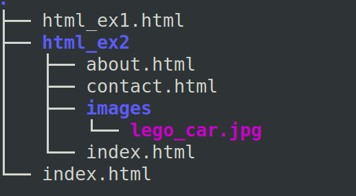
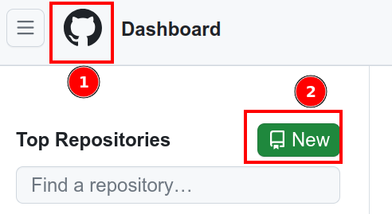
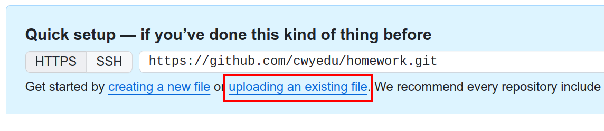
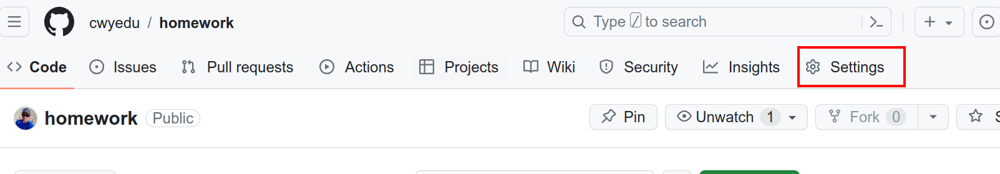
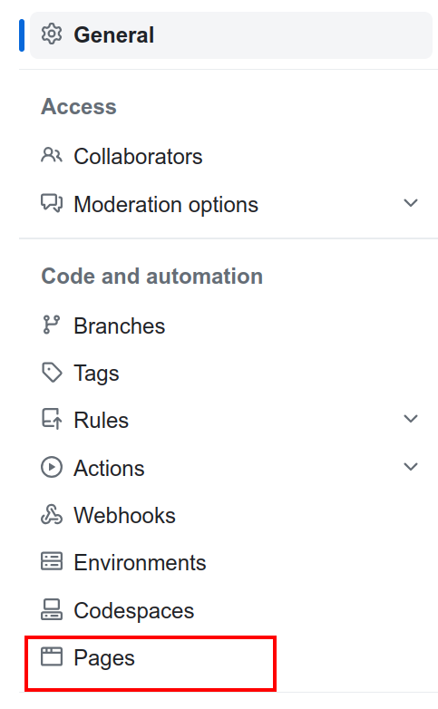
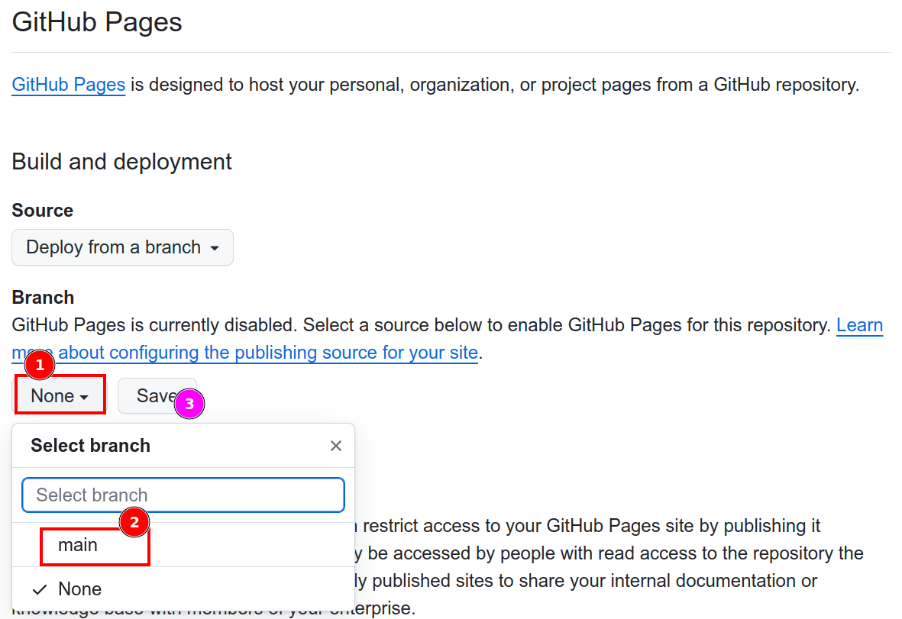
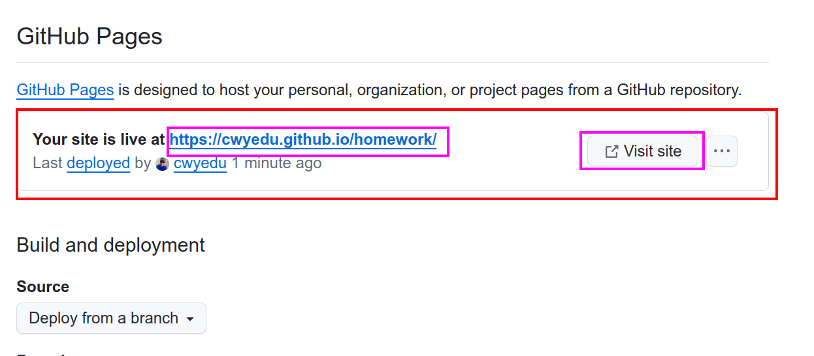

# 作業上傳 github

- 請先申請 [GitHub](https://github.com/) 帳號
- 請整理你的作業，假設你的資料夾叫「website」，它的內容結構如下：
  
- 按左上角的貓咪，新增一個儲存庫 homework
  
- 輸入儲存庫名稱，並按最下方的 Create repository
- 選擇上傳如下圖：
  
- 把你的所有檔案拖移過去上傳，並按 Commit changes
  
- 這時，應該會進入該儲存庫，請按 Settings
  
- 請在最左邊，找到 Pages
  
- Branch 選擇 main，並 Save
  
- 等一下，和隔壁同學討論一下剛剛在做什麼，當你知道以後，按 F5，畫面會如下圖：
  
- 連到該網址，恭喜，你成功了
