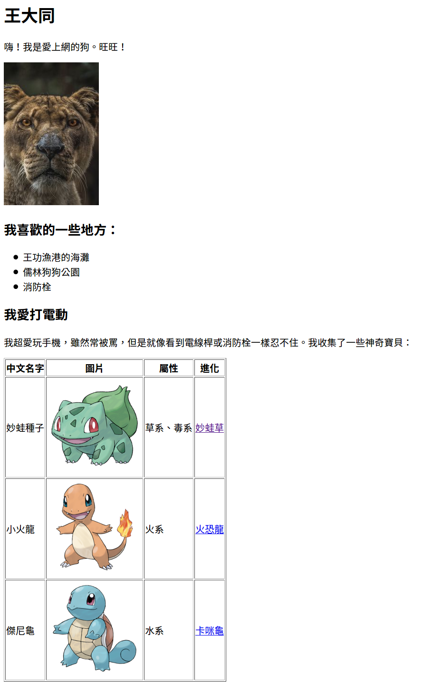

# html_ex1

- 請製作一個如下圖之網頁，並命名為 `html_ex1.html`
- 想一想，你如何讓別人看到你的網頁？
- 把這個檔案上傳到伺服器，並[繳交分享連結](https://classroom.google.com/c/NjE2NjkwNzczMDMw/a/NjY0MDk1MzI2OTI3/details)



文字內容：

```
中文名字
	妙蛙種子
圖片
	http://img4.wikia.nocookie.net/__cb20140328190757/pokemon/images/thumb/2/21/001Bulbasaur.png/200px-001Bulbasaur.png
屬性
	草系、毒系
進化
	妙蛙草
	http://pokemon.wikia.com/wiki/Ivysaur 


中文名字
	小火龍
圖片
	http://img4.wikia.nocookie.net/__cb20140724195345/pokemon/images/thumb/7/73/004Charmander.png/200px-004Charmander.png
屬性
	火系
進化
	火恐龍
	http://pokemon.wikia.com/wiki/Charmeleon 
	

中文名字
	傑尼龜
圖片
	http://img1.wikia.nocookie.net/__cb20140328191525/pokemon/images/thumb/3/39/007Squirtle.png/200px-007Squirtle.png
屬性
	水系
進化
	卡咪龜
	http://pokemon.wikia.com/wiki/Wartortle
```