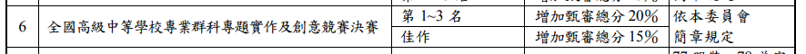
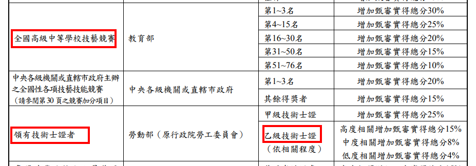

# 專題起步走

先看一些資料，心裡有個底，專題比賽到底是什麼：

- [全國專題及創意競賽最新消息](https://vtedu.k12ea.gov.tw/nss/s/business/contestnews)
- [商業與管理群科中心 - 歷年競賽得獎作品及資源分享](https://vtedu.k12ea.gov.tw/nss/s/business/505)
- [【研習資料】111學年度教師研習(十三)「商管群全國專題實作教學及指導技巧線上課程研習」評審指導教學與評析](https://vtedu.k12ea.gov.tw/nss/business/freeze/5abf2d62aa93092cee58ceb4/O5Td6db0277/64a637a7484b312c4d3502c6?vector=private&static=false)

## 好處

- 甄審或甄選時，需上傳的資料，都有一項是專題
- 取得技優甄審的門票
  
- 技藝競賽和乙級也都可以取得技優甄審的資格
  
- **學會如何選定一個目標並完成**

## 選題

- 先看看比賽得獎的都是做哪方面
- 看看自己生活週遭有哪些特殊不同的產業或活動