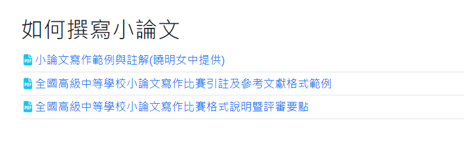

# 樣式(小論文格式)

請到 [小論文競賽訊息- 中學生網站](https://www.shs.edu.tw/Customer/Information/EssayIndex)，參考下面資料：



如果需要假文，可用 [亂數假文產生器](http://www.richyli.com/tool/loremipsum/)

## 步驟

- 頁首、頁尾
- 設定樣式
- 定義新的多層次清單
- 加入資料
- 加入目錄


練習內容： (小論文網站範例)
```
壹、前言
一、研究動機
美國紀錄片電影「請服藥（take your pills）」中描寫美國高度競爭的社會中，學生、運 動員、商業經理人、程式設計師等為了提昇效率及最佳表現，服用聰明藥丸（smart drugs） 以提昇個人表現。考生謊稱自己患有過動症，甚至也有父母幫忙誆騙醫師，藉以取得聰明 藥的處方箴，為的就是能夠熬夜而不累，並擁有高專注力或高讀書工作效率。
身為高中學生，面對沉重的課業與無止境的考試，對於影片中號稱可以讓人瞬間提升記憶力和學習效率的神奇聰明藥丸感到十分好奇，想要一窺究竟。聰明藥丸是否真像傳播媒體所報導這麼神奇，而藥物的化學成份是什麼？及它在體內及腦神經機轉為何？聰明藥丸和傳統的咖啡因飲料效果有無不同？而這個神奇速效藥的背後是否需要透支生命健康作為代價？若聰明藥真有神奇之處，未服藥與服用聰明藥者競爭是否是一場不公平的競爭，服藥是否視為作弊的一種？藥物使用的倫理議題亦讓研究者十分感興趣。另外，聰明藥的未來前景為何？還是可能有其他的改良與發展，本研究亦將進一步了解。
二、研究目的
（一）了解什麼是聰明藥，探討藥物種類、效能及成份。
（二）藥物副作用及腦神經學機制。
（三）比較聰明藥和咖啡因的差異。
（四）問卷調查國內用藥認知及用藥倫理。
（五）歸納了解聰明藥未來發展前景並提出建議。
貳、文獻探討
聰明藥究竟是什麼？及為什麼可以讓人覺得變聰明？從相關研究者謝蕙霞（2018）及Larissa J.,＆MaieraJason A.（2018）相關文獻回顧中發現「藥理性的認知增強處方劑」（Pharmacological Cognitive Enhancement，以下簡稱 PCE），通常是指用以提高記憶力或注意力的藥品。而這些益智健腦處方藥物，有個將藥物效果奇蹟化的時髦別名即「聰明藥」（smart drugs）。提高記憶力或注意力的藥物在部份的歐洲國家或美國地區亦可泛指尼古丁、大麻、酒精等具提神效能的藥品（Nature news, 2018）。
一、聰明藥的種類
「目前國際上被稱『聰明藥』（smart drugs）主要有三種，分別為 Adderall、Methylphenidate，以及 Modafinil 」（ 謝蕙霞，2018）。由於智益健腦藥物在世界各國及不同 文 獻研究中的 定 義 略 有 不 同 ， 而 本 研 究 將針對國際較普遍認定的 Adderall 、Methylphenidate，以及 Modafinil 這三類聰明藥做為本研究主要研究藥物。將進一步進行化學成份、副作用、腦部影響等探討。
二、聰明藥與咖啡因提神差異
對於聰明藥和生活中常見咖啡因提神方法的探討，黃榮棋（譯）（2003）研究中指出咖啡因的作用確實會提神，讓人警覺性提高，屬於興奮劑一種，和聰明藥一樣有提神醒腦的效果。但相關比較仍較為缺乏，本研究將進一步整理不同種類聰明藥和咖啡因的成份、機制及成效等等，比較其和生活中熟悉的提振精神提高工作效率的咖啡因相異處與相同處。
三、聰明藥的用藥倫理
針對全球聰明藥物使用狀況或用藥倫理調查的部份，參考 Larissa J.,＆MaieraJason A.（2018）所做全球藥物調查了解聰明藥物在全球的使用狀況如圖一。這份調查於 2015 年及2017 年兩個年度，以匿名跨國網路調查方式，涵蓋了 15 個國家和地區，分析了非注意力不足過動症（Attention Deficit Heperactivity Disorder, 簡稱 ADHD）的患者使用 PCE 藥物的調查報告，其中 2015 年樣本數為 79,640 人，2017 年樣本數為 29,758 人，受測者為學生身份的比例兩個年度分別為 43.3%和 35.3%。從採樣的十五國家的來看，發現近年來各國使用聰明藥比例上均有明顯上升。兩個年度均以美國使用比例最高，並由 2015 年 20%上升至 2017 年30%。就 2015 和 2017 年的使用成長率來說，用藥成長輻度最明顯的兩個國家為 FR（法國）增加 600%以及 IR （荷蘭）增加 553%。
而國內目前相關研究調查及現況了解也相對較為缺乏，除了了解國際調查狀況外，本研究亦希望進一步採網路表單問卷方式了解國內聰明藥認知現況及用藥倫理認知探討。
參、研究方法
一、研究方法
（一）文獻分析法：透過科學人、科學月刊及相關國內外醫療期刊了解聰明藥物的種類及功效，並利用美國藥物資料查詢系統及默克藥廠生物化學醫療藥物資料庫了解各類藥物化學成份及副作用。進而整理成表格，並使用生物繪圖軟體 Biorender App 繪製進行藥物腦神經學機制說明，更進一步比較聰明藥物和咖啡因在提昇學習工作效率時的差異。
（二）問卷調查法：透過 Google 表單進行網路問卷調查，調查國內聰明藥物的使用狀況及看法，了解大家對於聰明藥物是否有正確的認知並比對國際調查結果差異。問卷回收 302 份，調查的對象以青少年為主，其中高中生占 53％，次為國中生占 21.5％，大學生占 4.6％，其他則分散於各年齡組。
二、研究流程

三、研究架構

肆、研究分析與結果
聰明藥（smart drugs）學術上實名為「藥理認知增強處方劑」，也就是可以提昇注意力或提神的益智健腦的處方藥物。三大類藥物中成份為 Methylphenidate（派醋甲酯）的 Ritalin （利他靈等），及主成份為 Amphetamine（安非他命）的 Adderall，兩者是結構相似的藥物。另一種則是用來治療嗜睡症成份為 Modafinil 的 Provigil（普衛醒），亦是中樞神經系統興奮劑的一種，讓人保持清醒並增加注意力及警惕性，因此可用來改善嗜睡症患者白天過度睡眠症狀。以下將更進一步的分析聰明藥的成份效能、聰明藥腦神經學機轉、使用聰明藥前後的腦部 FMRI 研究、並比較聰明藥和咖啡因的差異，最後進行台灣青少年用藥倫理思辨問卷調查與分析。
一、各類聰明藥成份效能分析
由於聰明藥雖然可以集中注意力、讓人不想睡覺，使得熬夜不累，但對身體有其副作用，以下以表格整理來說明三大類聰明藥物的成份、商品名稱、適應症、藥物效能及藥物副作用、化學成份等，說明如表一。
二、聰明藥腦神經學機轉分析
聰明藥主要為中樞神經興奮劑，但不同種類的聰明藥從藥理來說機制略有差異。以下將以台灣核准藥物的Ritalin和Modafinil加以比較說明，由於Adderall藥物在台灣並未核淮，以下本研究將以 Ritalin 和 Modafinil 為主進行腦神經學機轉探討。Ritalin 屬於腎上腺素與多巴胺再攝取抑制劑（Norepinephrine–Dopamine Reuptake Inhibitor 簡稱 NDRI）。腎上腺素與人的注意力集中有關。所以 Ritalin 的主要作用，是使人們的注意力更加集中，故 Ritalin 主要用於治療注意力不足的 ADHD 患者。
而 Modafinil 屬於多巴胺再吸收抑制劑（Dopamine Reuptake Inhibitor 簡稱 DRI），通過抑制人體對多巴胺的再吸收，提高人體內的多巴胺濃度。由於腦內多巴胺的濃度提高了，濃度提高的結果，主要有兩個影響：第一個是人的心情變好，第二個是睏意減輕。故Modafinil 適用於治療嗜睡症、猝睡症、憂鬱症等。
以神經學來說，神經構造中軸突的末端為突觸，突觸前細胞會利用突觸釋出神經傳遞物給突觸後細胞如圖十標示Ａ處，突觸末端小泡所釋出的化學物質，可以使次一神經元產生衝動，使神經衝動繼續傳遞下去，而最常見的神經傳導物有乙醯膽鹼、多巴胺、腎上腺素、血清素等如圖十標示Ｂ處。藥物作用於神經學的機制，進一步研究者以 Biorender App 生物繪圖軟體繪製示意圖進行更深入的說明，以示意圖比較一般正常的神經突觸活動，與用聰明藥物後的神經突觸活動，以表二及圖十一和圖十二來進一步解釋說明。
三、使用聰明藥的腦部 FMRI 研究
進一步以神經學相關研究，國外學者 Monica D. Rosenberg（2016）等曾以功能性核磁共振（FMRI， Functional Magnetic Resonance Imaging），來觀察非 ADHD 患者服用聰明藥 Methylphenidate 的腦部變化如圖十三，藉以比較服用聰明藥組別與控制組間的差異，觀察發現藥物影響了與持續注意力相關的功能性大腦網絡，確有提昇專注力的效果，進一步說明如下：
在專注力測驗當下，如圖十三標示A，相較於控制組，服用聰明藥Methylphenidate組別在工作時有較高的高注意力網絡（和該工作有關的腦部網絡）和較低的低注意力網絡（和此工作無關的腦部網絡），也就是工作專注度有所提昇，較不容易分心於工作無關的其他事物。   在專注力測驗間的休息時間，如圖十三標示Ｂ，相較於控制組，服用藥物組別在休息時有較高的高注意力網絡（和工作有關的腦部網絡）和較低的低注意力網絡（和工作無關的腦部網絡），也就是測驗休息時間服用聰明藥組別亦比控制組專注度高。

```
