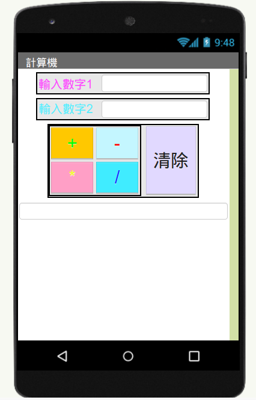

# 極簡單計算機

參考：[手機App -計算機製作](https://youtu.be/NNdwDQWAkrc?si=g9HebF9jS8EpMmqs)

!!! abstract "目標"

    - 寫一個極簡單計算機 (+、-、*、/、清除)
    - 使用「介面配置」
    - 執行四則運算，並顯示在相應的文字輸入盒內
    - 今天練習用 aiStarter 看程式效果

畫面編排：

