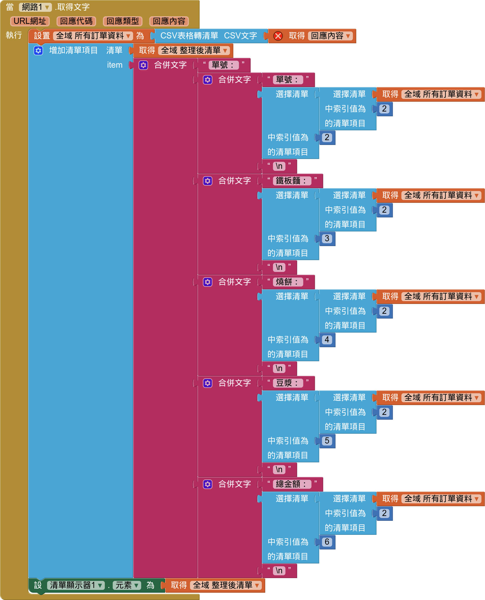

# 點餐系統

參考：

- [112_康軒版_國中9下資訊科技課本_APP專題3-2.APP點餐 羅東國中資訊組](https://youtu.be/5ecAp1cDBLE?si=W4KHhxpLDwIbnjTh)
- [112_康軒版_國中9下資訊科技課本_APP專題3-3.APP點餐 羅東國中資訊組](https://youtu.be/wE8upY3x-Zk?si=kKNiC1_3Lcz-DEwG)

!!! abstract "目標"

    - 完成一個點餐系統
    - 點餐
    - 查詢

## 界面設計與基本金額統計

先設計界面，想一想，如何做：[訂單畫面設計](https://www.figma.com/file/zH80LRsBXZMmp1wFlydmym/%E9%BB%9E%E9%A4%90%E7%B3%BB%E7%B5%B1-APP?type=design&node-id=0%3A1&mode=design&t=PAvy2EwJQgqkZMLU-1)

程式：顯示所有對應的金額

!!! warning

    記得，那幾個總額的文字要設為 0

## 資料寫入

想一想，你要將資料寫到那？這裡我們使用 google 表單

- 請先設計一個 google 表單如下圖：

- 設定：

- 在畫面編排中，插入「通訊」->「網路」
- 在程式設計中，插入 「當按鈕被點選」，加人網路網址
  
網址設定：

- 取得預先填入網址

- 拷貝網址：如「https://docs.google.com/forms/d/1gQVJT4NQx3AxPV55dU7vkJTw9ApoBLQ/prefill」, 貼到記事本
- 將「prefill」改成 「formResponse?」
- 填入一些資料，按取得連結->複製連結如圖：

- 將網址貼到記事本，改成如下圖，3即是我們要的資料

- 把這些東西加到網路中的網址
- 最後如下圖

- 測試你的手機是不是能夠填入資料，送出時會不會在 google 表單中新增資料
- 每次送出，就將單號加1，並清除其它欄位值

!!! 重要
    
    先確你訂單的資料可以寫入 google 表單的回應試算表內

## 資料讀出

- 新增畫面
- 畫面設計 (標題、按鈕、清單顯示器)
- 想一想 google 試算表如何分享
    - 共用設定 -> 所有人
    - 共用 -> 發佈到網路
    - 選擇網頁 -> 逗號分隔值
- 加入網路
    - 設定網址
    - 網路請求 (get)
    - 先測試看看，並看回傳什麼

- 將表單資料一個一個對應出來顯示

<!--  -->

- 這是一個只顯示第 1 筆資料，修改一下，用迴圈，把所有資料顯示出來

!!! 加分

    你能再做一個畫面，讓程式一開始時可以選擇要新增訂單，還是查詢訂單嗎？