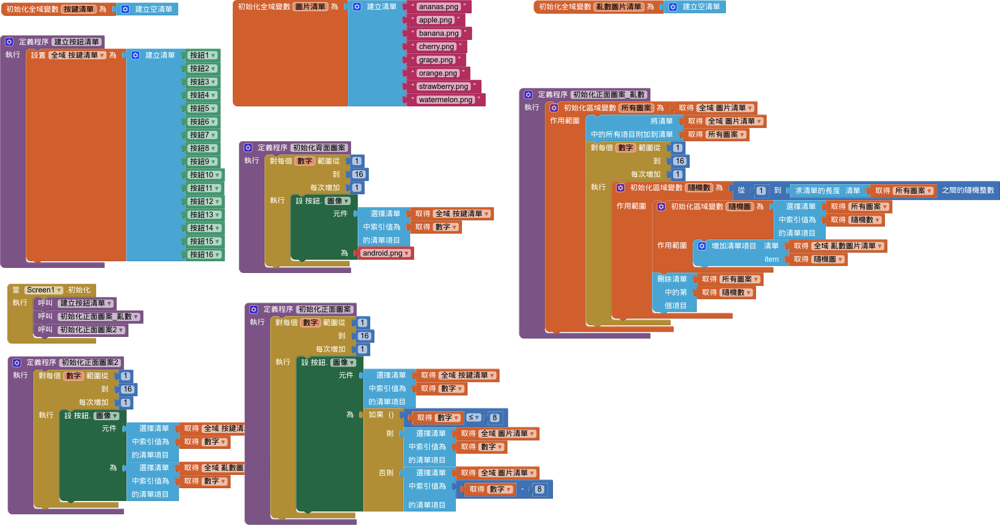

# 配對遊戲

參考：[水果配對](https://book2.17coding.net/chapter1.html)

!!! abstract "目標"

    - 下載、處理所需圖片
    - 會使用清單
    - 
    - 

- [PNGWing](https://www.pngwing.com/) 下載 8 張 80x80 水果圖片
- 界面設計
- 螢幕初始化
    - 建立按鈕清單
    - 顯示按鈕背面圖
    - 建立圖片名稱清單
    - 顯示按鈕正面圖
    - 亂數顯示按鈕正面圖

