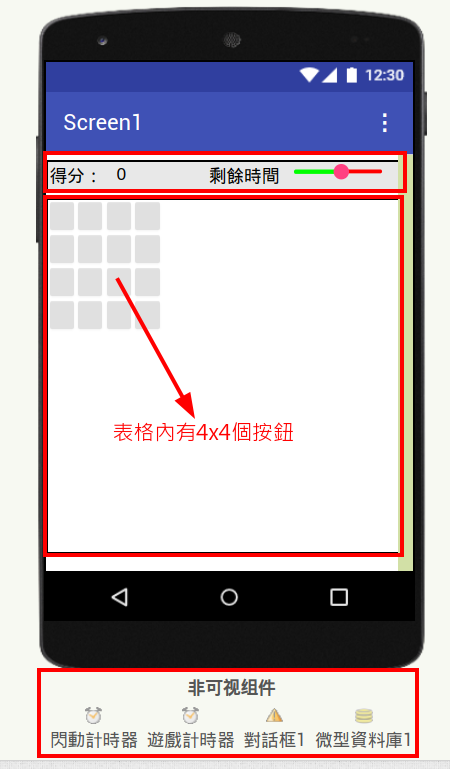
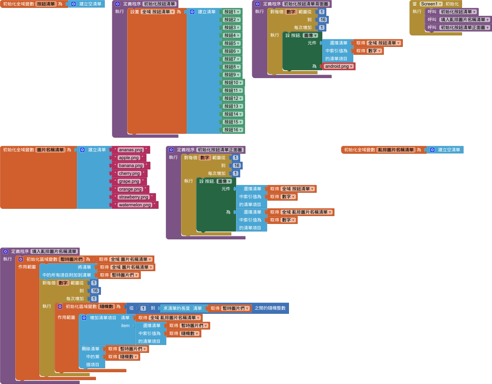

# 配對遊戲

參考：[水果配對](https://book2.17coding.net/chapter1.html)

!!! abstract "目標"

    - 下載、處理所需圖片
    - 會使用清單
    - 
    - 
## 開始 & 界面設計
- [PNGWing](https://www.pngwing.com/) 下載 8 張 80x80 水果圖片
- 界面設計
  

## 螢幕初始化

### 背面圖
- 建立按鈕清單
- 顯示按鈕背面圖

### 正面圖

- 建立圖片名稱清單

- 顯示按鈕正面圖

- 在 screen1 中呼叫「初始化按鈕清單正面圖」
- 看一下，是不是顯示出水果圖案了

### 亂數顯示按鈕正面圖

接下來，我想做一件事情，把「圖片名稱清單」想辦法弄到另一個清單，而且是**亂數**排列的。

- 產生一個全域的「亂排圖片名稱清單」
- 定義一個程序「填入亂排圖片名稱清單」
    - 暫時內變量「暫時圖片們」
    - 想辦法把2份圖丟到「暫時圖片們」
    - 把「暫時圖片們」取亂數丟到「亂排圖片名稱清單」，並刪除

- 修改「初始化按鈕清單正面圖」
- 在 screen1 中增加呼叫「填入亂排圖片名稱清單」

!!! tip "停看聽"

    好了，目前為止，請仔細想想，你到底做了什麼。

    

!!! question "想一想"

    你可以用別的方法處理「亂排圖片名稱清單」嗎？

    